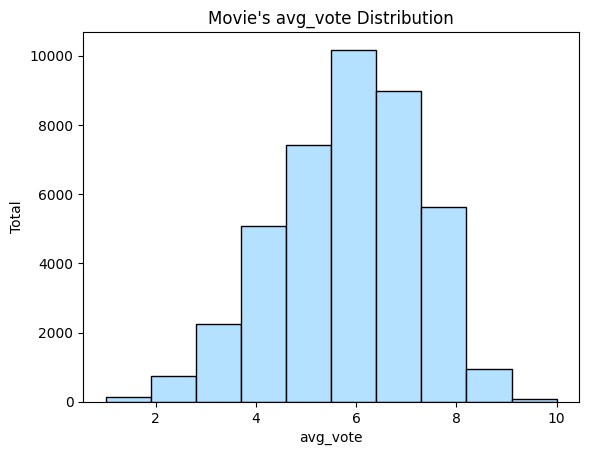
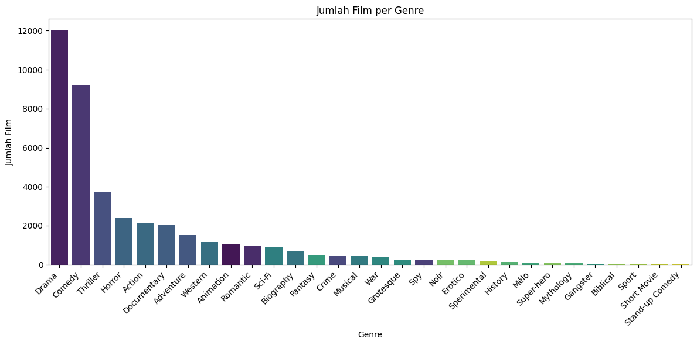
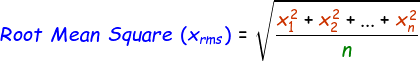
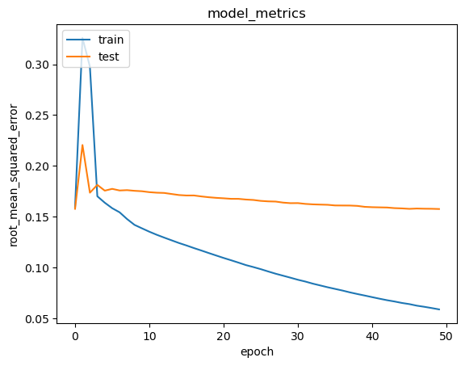

# Sistem_Rekomendasi_Dicoding

data : [kaggle](https://www.kaggle.com/datasets/stefanoleone992/filmtv-movies-dataset?select=filmtv_movies.csv)

## Project Overview
Film adalah bentuk seni visual yang menggunakan gambar bergerak (moving images) untuk menceritakan sebuah kisah, menyampaikan ide, atau menghibur penonton. Istilah "film" berasal dari kata "filmstrip" (seluloid), yaitu material fisik yang dahulu digunakan untuk merekam gambar dalam industri sinema. sistem rekomendasi dapat memberikan rekomendasi personalisasi kepada pengguna berdasarkan preferensi, perilaku, atau data historis mereka. Sistem ini dapat digunakan di berbagai bidang seperti e-commerce, konten digital (film/musik), buku, atau layanan lainnya.

Sistem rekomendasi dalam bidang film penting diselesaikan karena memiliki tujuan untuk meningkatkan pengalaman pengguna dengan menyarankan konten yang relevan berdasarkan preferensi mereka. Berikut beberapa fungsi utamanya:
1. Personalisasi Konten
2. Meningkatkan Engagement Pengguna
3. Mengatasi Overload Informasi
4. Mendorong Penemuan Konten Baru
5. Meningkatkan Retensi Pelanggan
6. Strategi Bisnis untuk Platform
sistem ini menawarkan keuntungan signifikan bagi pengguna dan penyedia karena pengguna dapat menemukan movie yang dia gemari. sementara perusahaan dapat meningkatkan jumlah penonton, menyediakan konten yang beragam, meningkatkan kepuasan pelanggan.

## Business Understanding
Pembuatan dan pengembangan sistem rekomendasi memiliki potensi untuk memberikan manfaat bagi pengunjung dan penyedia. sistem rekomendasi dapat membantu pengguna menemukan movie yang sesuai dengan kesukaan mereka dengan melihat riwayat mereka. Cara tersebut dapat memberikan kemudahan dan efisiensi dalam mencari movie yang disukai oelh pengguna.

### Problem Statements
1. Bagaimana tahap dalam membuat sistem rekomendasi yang dapat memberikan pengguna rekomendasi movie berdasarkan genre movie?
2. Bagaimana penyedia platform memberikan rekomendasi movie yang belum pernah ditonton pengguna dengan menggunakan data rating?
3. Bagaimana cara membuat model development dengan content based filtering menggunakan cosine similarity dan membuat model development dengan collaborative filtering menggunakan KNN?
4. Bagaimana cara mengukur performa dari model sistem rekomendasi yang telah dibangun?

### Goals
Sistem rekomendasi dibuat untuk menjawab permasalahan dengan tujuan berikut:
1. Dapat memberikan rekomendasi Movie kepada pengguna sebanyak Top-N rekomendasi berdasarkan genre
2. Dapat memberikan beberapa rekomendasi movie yang belum pernah ditonton sesuai dengan riwayat pengguna
3. Dapat membuat model sistem rekomendasi content based filtering menggunakan cosine similarity dan membuat model development dengan collaborative filtering menggunakan KNN berdasarkan feature dalam dataset
4. Dapat mengukur performa model sistem rekomendasi dengan menggunakan metriks evaluasi 

### Solution Approach
Untuk menyelesaikan permasalahan tersebut kita membuat alur pengerjaan dalam pembuatan model. Dalam alur Exploratory Data Analysis kita menganalisa data dan mevisualisasikan data. Selanjutnya data dipersiapkan sebelum masuk ke modeling dengan masuk pada tahap data cleaning dengan melakukan pengecekan missing value, melakukan pengecekan nilai duplikasi, menghapus nilai yang tidak sesuai standart, menghapus missing value. Pada tahap preprocessing kita melakukan teknik one hot encoding untuk merubah tipe data kategorikal menjadi nilai numerik agar dapat diproses oleh komputer.

## Data Understanding
### Exploratory Data Analysis
Kumpulan dataset didapatkan dari platform kaggle, website ini menyediakan dataset beragam dari yang kumpulan data dan juga kumpulan gambar. [Film TV Dataset](https://www.kaggle.com/datasets/stefanoleone992/filmtv-movies-dataset?select=filmtv_movies.csv) adalah dataset yang digunakan untuk membuat model rekomendasi. Dataset didapatkan dari website [filmtv](https://www.filmtv.it/) merupakan website yang memberikan informasi mengenai berbagai macam film.
**Informasi detail mengenai dataset :**
1. dataset yang kita gunakan adalah satu file csv (comma-seperated values) bernama ***filmtv_movies.csv***
2. dataset memiliki jumlah sample dan fitur
3. terdapat *Missing value* pada fitur berikut:
    - genre sebanyak 95 data
    - country sebanyak 10 data
    - directors sebanyak 34 data
    - actors sebanyak 2127 data
    - critics_vote sebanyak 4696 data
    - public_vote sebanyak 194 data
    - description sebanyak 1542 data
    - notes sebanyak 22602 data
4. tidak ada data yang duplikat
untuk detail informasi dari setiap feature adalah sebagai berikut
5. terdapat 9 kolom dengan tipe data **int64**, kolom tersebut adalah:
    - `filmtv_id`: key feature dari film tv yang diambil dari website
    - `year`: tahun muncul film
    - `duration`: lama waktu durasi film dalam menit
    - `total_votes`: jumlah vote dari critics dan public
    - `humor`: skor untuk movie humor dari filmtv
    - `rhythm`: skor untuk ritme movie dari filmtv
    - `effort`: skor untuk effort movie dari filmtv
    - `tension`: skor untuk tensi movie dari filmtv
    - `erotism`: skor untuk nilai erotis dalam movie dari filmtv
6. terdapat 7 kolom dengan tipe data **object**, kolom tersebut adalah:
    - `title`: judul original untuk movie
    - `genre`: genre dari movie
    - `country`: negara tempat memproduksi movie
    - `directors`: nama dari direktor movie tersebut
    - `actors`: nama dari aktor movie
    - `description`: deskripsi dari movie
    - `notes`: info tambahan unutk movie
7. terdapat 3 kolom dengan tipe data **float64**, kolom tersebut adalah:
    - `avg_vote`: nilai rata-rata rating dari critics dan public
    - `critics_vote`: nilai rata-rata dari critics
    - `public_vote`: nilai rata-rata vote dari public

**Gambar persebaran avg_val**

dari hasil visualisasi data kita mengetahui bahwa nilai terbanyak terdapat pada nilai 6 dengan jumlah movie sebanyak 10000. dilanjutkan dengan nilai 7 yang memiliki jumlah movie sebanyak 9500.

**Gambar nilai categories distribution**

dari hasil visualisasi data kita mengetahui bahwa nilai terbanyak terdapat pada genre drama dengan 12000 movie, dilanjutnya dengan comedy, thriller, dan horror.

## Data Preparation
Proses data preparation dilakukan untuk mempersiapkan data sebelum masuk ke tahap modeling. tahap data preparation adalah sebagai berikut :
1. **cek duplikasi**
mengecek duplikasi digunakan agar tidak ada nilai yang double terutama pada bagian feature title. jika ada nilai double pada feature title akan membuat redundan data sehingga kita tidak dapat memastikan title tersebut memiliki nilai a atau nilai b. mengecek duplikasi dapat dilakukan dengan `df.duplicated().sum()` hasil dari pengecekan menunjukan bahwa **tidak ada nilai duplikat pada dataframe**.
2. **cek dan menangani missing values**
mengecek missing values dilakukan agar tidak ada data yang kosong terutama pada feature yang penting seperti title. jika ada nilai yang kosong akan susah bagi developer dalam membuat model rekomendasi. untuk mengecek missing value dilakukan cara `df_set.isnull().sum()` hasil dari pengecekan tersebut terdapat nilai duplikasi pada data. penanganan yang kita lakukan adalah melakukan drop nilai dengan cara `df_set.dropna(inplace=True)` hasil drop menunjukkan perubahan jumlah baris yang awalnya **41399** menjadi **39742**.
3. **cek dan menangani abnormal values**
mengecek abnormal values dilakukan agar tidak ada nilai yang berbeda dari nilai lainnya. untuk mengecek informasi tersebut kita gunakan program 
`df_set.genre.unique()`
untuk mengecek feature genre. pada feature genre tidak ada informasi yang aneh.
`df_set.directors.unique().tolist()[:10]` 
untuk mengecek feature directors. pada feature directors diketahui ada film yang memiliki satu director, dua director, dan diatasnya. dalam sistem rekomendasi ini kita hanya mengambil direktru utama saja, untuk co-director tidak kita tambahkan. penting untuk menampilkan satu direktur saja pada feature director karena feature ini akan dilakukan encoding. nilai pengecekan ternyata ada **2111**. Untuk mengatasi hal tersebut kita harus drop baris yang memiliki lebih dari 2 direoctor. Dari hasil tersebut kita mendapatkan feature directors hanya satu nama saja. Dengan nilai baris yang awalnya **3** menjadi **4**
4. **Encoding** : dilakukan untuk menyandikan `here` dan `here` ke dalam indeks integer. Tahapan ini diperlukan karena kedua data tersebut berisi integer yang tidak berurutan (acak) dan gabungan string. Untuk itu perlu diubah ke dalam bentuk indeks.
5. **Randomize Dataset** : pengacakan data agar distribusi datanya menjadi random. Pengacakan data bertujuan untuk mengurangi varians dan memastikan bahwa model tetap umum dan *overfit less*. Pengacakan data juga memastikan bahwa data yang digunakan saat validasi merepresentasikan seluruh distribusi data yang ada.
6. **Data Standardization** : Pada data rating yang digunakan pada proyek ini berada pada rentang 0 hingga 10. Penerapan standarisasi menjadi rentang 0 hingga 1 dapat mempermudah saat proses training. Hal ini dikarenakan variabel yang diukur pada skala yang berbeda tidak memberikan kontribusi yang sama pada model fitting & fungsi model yang dipelajari dan mungkin berakhir dengan menciptakan bias jika data tidak distandarisasi terlebih dulu.
7. **Data Splitting** : dataset dibagi menjadi 2 bagian, yaitu data yang akan digunakan untuk melatih model (sebesar 80%) dan data untuk memvalidasi model (sebesar 20%). Tujuan dari pembagian data uji dan validasi tidak lain adalah untuk proses melatih model serta mengukur kinerja model yang telah didapatkan.

## Modeling and Result
### Model Development dengan Content Based Filtering
content-based filtering adalah merekomendasikan item yang mirip dengan item yang disukai pengguna di masa lalu. salah satu cara menggunakna content based filtering adalah _Cosine similarity_. Cosine similarity adalah metode untuk mengukur seberapa mirip dua vektor dalam ruang multidimensi. Ini adalah pengukuran cosine sudut antara dua vektor yang dimensi dan magnitudonya direpresentasikan sebagai titik dalam ruang. Nilai similaritas kosinus berkisar antara -1 hingga 1, di mana nilai 1 menunjukkan kedua vektor sepenuhnya sejajar yang berarti mirip, 0 menunjukkan vektor tegak lurus yang berarti tidak ada ketertarikan, dan -1 menunjukkan kedua vektor sepenuhnya berlawanan arah yang berarti tidak mirip. Metode ini sering digunakan dalam pemrosesan teks dan pengelompokan data untuk menentukan tingkat kesamaan antara dokumen atau fitur dalam dataset. rumusnya adalah:

$$Cosine Similarity (A, B) = (A · B) / (||A|| * ||B||)$$ 

dimana: 
- (A·B)menyatakan produk titik dari vektor A dan B.
- ||A|| mewakili norma Euclidean (magnitudo) dari vektor A.
- ||B|| mewakili norma Euclidean (magnitudo) dari vektor B.

Kelebihan _Cosine Similarity_:
- Kompleksitas yang rendah, membuatnya efisien dalam perhitungan.
- Cocok digunakan pada dataset dengan dimensi yang besar karena tidak terpengaruh oleh jumlah dimensi.

Kekurangan _Cosine Similarity_:
- Hanya memperhitungkan arah dari vektor, tanpa memperhitungkan magnitudo (besarnya).
- Perbedaan dalam magnitudo vektor tidak sepenuhnya diperhitungkan, yang berarti nilai-nilai yang sangat berbeda dapat dianggap mirip jika arah vektornya sama.

### Model Development dengan Collaborative Filtering
Collaborative filtering bergantung pada pendapat komunitas pengguna. Ia tidak memerlukan atribut untuk setiap itemnya seperti pada sistem berbasis konten. Model collaborative filtering menggunakan penghitunngan skor kecocokan antara pengguna dan resto dengan teknik embedding. Pertama, kita melakukan proses embedding. Selanjutnya, lakukan operasi perkalian dot product antara embedding.  kita juga dapat menambahkan bias untuk setiap variable. Skor kecocokan ditetapkan dalam skala [0,1] dengan fungsi aktivasi sigmoid. Model Collaboratuve filtering ini menggunakan Binary Crossentropy untuk menghitung loss function. Adam (Adaptive Moment Estimation) sebagai optimizer, dan root mean squared error (RMSE) sebagai metrics evaluation.

## Evaluation
metrik RMSE (Root Mean Square Error) digunakan untuk mengevaluasi kinerja model yang dihasilkan. RMSE adalah cara standar untuk mengukur kesalahan model dalam memprediksi data kuantitatif. Root Mean Squared Error (RMSE) mengevaluasi model regresi linear dengan mengukur tingkat akurasi hasil perkiraan suatu model. RMSE dihitung dengan mengkuadratkan error (prediksi – observasi) dibagi dengan jumlah data (= rata-rata), lalu diakarkan. Perhitungan RMSE ditunjukkan pada rumus berikut ini.

`RMSE` = nilai root mean square error

`y`  = nilai hasil observasi

`ŷ`  = nilai hasil prediksi

`i`  = urutan data

`n`  = jumlah data

Nilai RMSE rendah menunjukkan bahwa variasi nilai yang dihasilkan oleh suatu model prakiraan mendekati variasi nilai obeservasinya. RMSE menghitung seberapa berbedanya seperangkat nilai. Semakin kecil nilai RMSE, semakin dekat nilai yang diprediksi dan diamati. Berikut adalah hasil dari pelatihan dan validasi :

Hasil pelatihan tersebut menunjukkan bahwa model mendapatkan nilai RMSE saat training pada nilai 0.058 dan nilai RMSE saat validasi pada nilai 0.157. dari hasil tersebut model sudah mendapatkan hasil yang bagus, namun model masih dapat ditingkatkan lagi.
